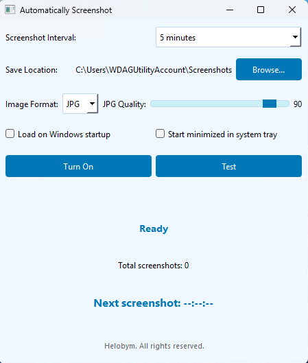

This software is developed by [Helobym](https://helobym.com)

The Automatically Screenshot software is a utility designed to capture screenshots of your computer screen at regular intervals without any manual intervention. This tool runs silently in the background and saves screenshots to a designated folder, allowing users to keep a visual record of their desktop activity over time.

[Demo Video](https://youtu.be/r8isST8_-gc)

